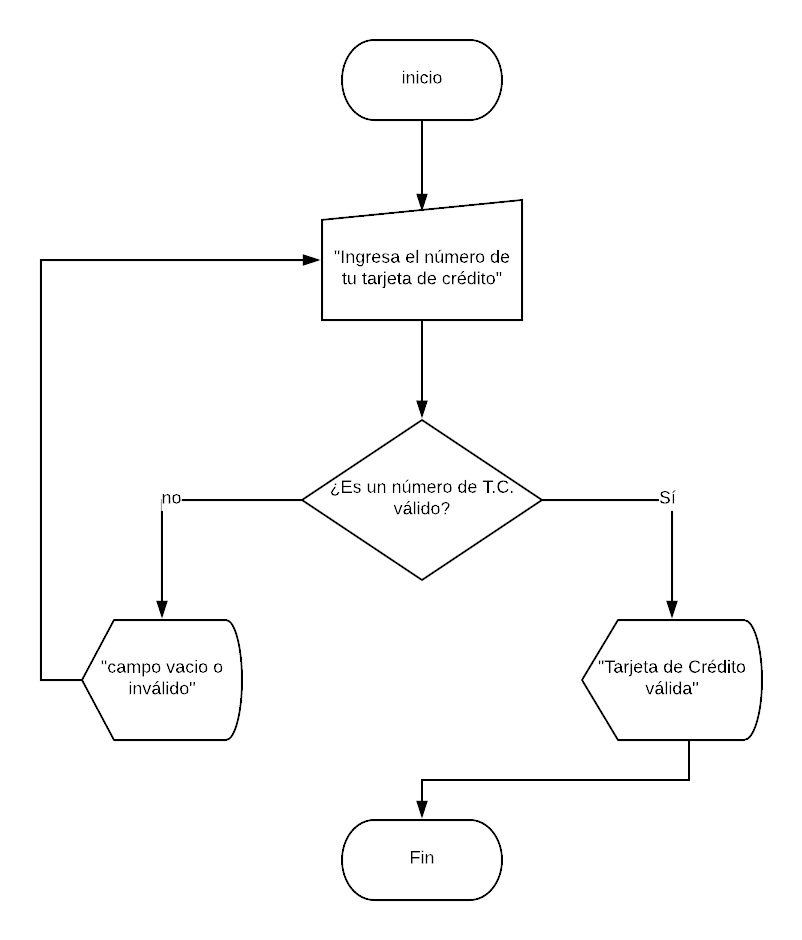

# Credit Car Validation

### Descripción:

Crea una web que pida, por medio de un prompt(), el número de una tarjeta de crédito y confirme su validez según el algoritmo de Luhn.

## Pseudocódigo:

1.- Pedir al usuario que ingrese su número de tarjeta 
2.- checar que no se haya ingresado un campo vacio. 
3.- Si no se ngreso número de T.C. regresar a pedir el dato 
4.- una vez que un número se ha ingresado validarlo (usar la función isValidCard) 
5.- mostrar resultado: "T.C. válida"

### Descripción:

1.- Tu código debe estar compuesto por 1 función: isValidCard 
2.- El usuario no debe poder ingresar un campo vacío

## Diagrama de flujo:

